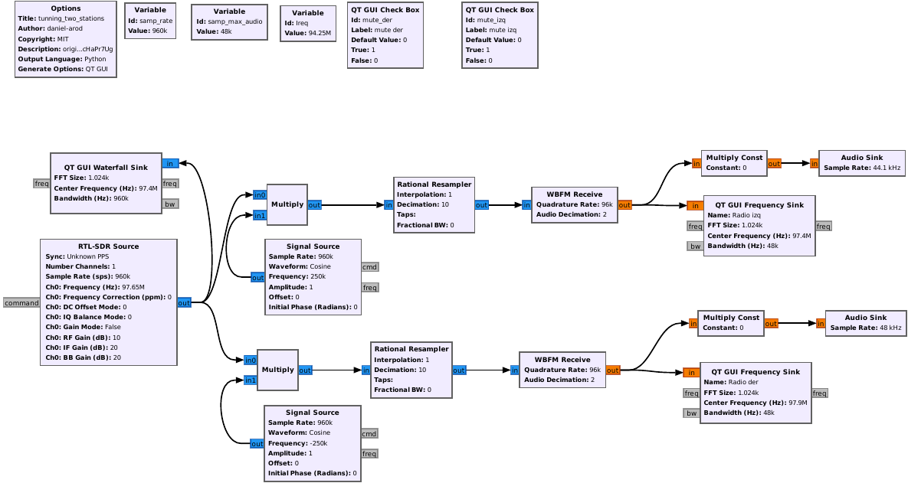

# GNU Radio examples
This porpouse of this repo is to show different examples of the use of GNU Radio. The files included are the `.grc` flowgraphs for GNU Radio and the `.py` for editing in python. Yu can also see a presentation used for Flisol Ecuador 2021 in Quito, is called `presentacion_Radios_definidas_por_software.pdf` and is in spanish.

## Examples
* Basic use: the idea is to show how a simple collection of blocks can produce a cosine IQ wave and present it in a GUI. The example is called `basic_example.grc` and `basic_example.py`. This example was adapted from [Cardona I guide](https://youtu.be/KCtcHaPr7Ug)

*  Tunning two radios: The idea is to show a GUI that can listen to two radios at the same time with one device. This example was adapted from [Cardona I guide](https://youtu.be/KCtcHaPr7Ug). The example is called `tunning_two_stations.grc` and `tunning_two_stations.py`

* Decoding AAUSAT-4 simple: Using [gr_satellites by Daniel Estevéz](https://github.com/daniestevez/gr-satellites) and the audio file `aausat_4.wav` from the [satellite recording repo](https://github.com/daniestevez/satellite-recordings) you can use the `Satellite decoder` block to transform a signal and the using the `Hex Dump` block to show HEX data of the satellite in GNU Radio. This example was adapted from [this talk](https://youtu.be/TceMth67r9c). The example is called `gr_satellites_simple.grc` and `gr_satellites_simple.py`

* Decoding BELIEF-SAT: A more advanced example [presented by Daniel Estevéz](https://youtu.be/TceMth67r9c), it uses a more complex Decoding process, from filtering using  `Frecuency Xlating FIR Filter` and `Low Pass Filter`, then demodulation using `Quadrature Demod` and `FSK Demodulator` blocks and finally  deframe the signal using `CCDS Reed-Solomon Deframer` block to obtain HEX values of the satellite. I uses the `SDRSharp_20200704_132444Z_435912500Hz_IQ.wav` audio file from [BeliefSat repository](https://github.com/NewLeapKjsieit/BeliefSat)

## Licence
MIT <3, but please cite this work in academic research.